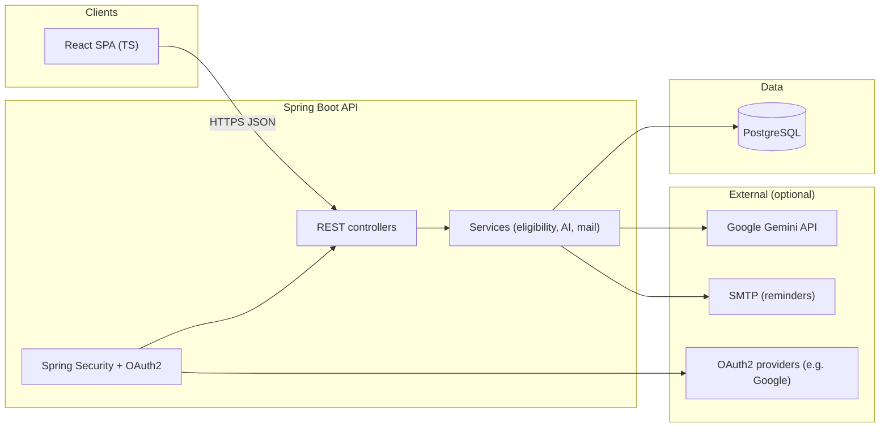

# Scheme Navigator

**Government Scheme Navigator** helps citizens discover government schemes they may be eligible for, understand why they qualify (or not), and get practical application guidance — with optional multilingual support. This repository holds the **Spring Boot backend** and static assets. The primary **React + TypeScript (Vite)** UI lives in a separate repository: **[governmentSchemeUi](https://github.com/mominYaseen/governmentSchemeUi)**.

---

## Related repositories

| Repository | Role |
|------------|------|
| **This repo** (`governmentScheme`) | Backend API, PostgreSQL schema, optional `static/` assets |
| **[governmentSchemeUi](https://github.com/mominYaseen/governmentSchemeUi)** | Frontend SPA: catalog, recommend, match, OAuth2 / demo auth — see its README for env vars (`VITE_API_BASE_URL`, `VITE_AUTH_MODE`) and routes |

---

## System design (from scratch)

### High-level architecture



### Logical layers

| Layer | Responsibility |
|--------|----------------|
| **Presentation** | React SPA (Vite); calls REST with `fetch`/axios; OAuth2 redirect handled by Spring + frontend callback URL. |
| **API** | REST resources under `/api/**`; OpenAPI (springdoc) for discovery. |
| **Application** | Orchestration: parse user profile, match schemes, call AI for explanations, persist saved schemes, send mail. |
| **Domain** | Entities (users, schemes, saved schemes, eligibility snapshots) and business rules. |
| **Infrastructure** | JPA repositories, PostgreSQL, Gemini HTTP client, JavaMail, OAuth2 client config. |

### Main data flows

1. **Catalog** — Load scheme metadata from DB (and/or imported CSV pipeline) for browse/search.
2. **Recommend / match** — User profile (structured or extracted from text) → rule + metadata matching → ranked or filtered schemes.
3. **Explain** — Optional Gemini calls for plain-language eligibility narrative and next steps (JSON-shaped responses where configured).
4. **Saved schemes** — Authenticated user persists favorites or bookmarks via REST; reminders may use scheduled jobs + SMTP.
5. **Admin / import** — Dataset import (e.g. CSV) populates or updates scheme tables (see `docs/DATASET_AND_SCHEMA.md` and `schema.sql`).

### Database (conceptual)

Relational model in PostgreSQL: schemes, categories/tags, user accounts (OAuth-linked), saved schemes, and optional audit or import metadata. Authoritative DDL and notes live in **`schema.sql`** and **`docs/DATASET_AND_SCHEMA.md`**.

---

## Tech stack

| Area | Choice |
|------|--------|
| **Language / runtime** | Java 21 |
| **Backend framework** | Spring Boot **3.5.x** (Web, Data JPA, Validation, Security, OAuth2 Client, Mail) |
| **API docs** | springdoc-openapi |
| **Build** | Maven |
| **Database** | PostgreSQL |
| **AI (optional)** | Google **Gemini** API (HTTP from Spring services) |
| **Frontend** | **React** + **TypeScript**, **Vite** — source in **[governmentSchemeUi](https://github.com/mominYaseen/governmentSchemeUi)** |
| **Auth** | OAuth2 login (e.g. Google); session/JWT patterns per `SecurityConfig` |

---

## Ports and URLs

| Service | Default port | Notes |
|---------|----------------|-------|
| **Backend (Spring Boot)** | **8080** | Override with environment variable `PORT` (see `application.properties`). |
| **Frontend (Vite dev)** | **5173** | Align with CORS and `app.auth.frontend-url` in `application.properties` (`http://localhost:5173`). |
| **PostgreSQL** | **5432** | JDBC URL and database name in `application.properties` (e.g. `schemenavigator`). |

Production: terminate TLS at a reverse proxy or platform ingress; set `app.auth.frontend-url` and OAuth redirect URIs to HTTPS origins.

---

## Repository layout (this repo)

```
├── pom.xml
├── schema.sql
├── docs/
├── src/main/java/com/schemenavigator/   # controllers, config, domain, services
├── src/main/resources/
│   ├── application.properties
│   └── static/                          # optional static assets
```

Clone and run the UI from **[governmentSchemeUi](https://github.com/mominYaseen/governmentSchemeUi)** separately.

---

## Prerequisites

- JDK 21, Maven 3.9+
- PostgreSQL 14+ (16 recommended)
- Optional: Gemini API key, OAuth2 client credentials, SMTP for mail
- For the full stack: Node.js 18+ in the frontend repo ([governmentSchemeUi](https://github.com/mominYaseen/governmentSchemeUi))

---

## Configuration

Copy or edit environment-specific values (never commit secrets):

- **Datasource** — `spring.datasource.*`
- **OAuth2** — `spring.security.oauth2.client.registration.*`
- **Gemini** — `app.gemini.*` (if used)
- **Frontend URL / CORS** — `app.auth.frontend-url`, `app.cors.allowed-origins`
- **Mail** — `spring.mail.*` and app mail flags

Local DB example: create database `schemenavigator`, run `schema.sql`, then point JDBC URL at `localhost:5432`.

---

## Run locally

**Backend**

```bash
mvn spring-boot:run
```

API base: `http://localhost:8080` (or `$PORT`). OpenAPI UI: `{BASE}/swagger-ui/index.html` (OpenAPI JSON: `{BASE}/v3/api-docs`).

**Frontend** — clone [governmentSchemeUi](https://github.com/mominYaseen/governmentSchemeUi), then:

```bash
cd governmentSchemeUi
npm install
export VITE_API_BASE_URL=http://localhost:8080
npm run dev
```

Ensure the dev server origin matches CORS allowlist (default includes `http://localhost:5173`). For OAuth2 vs demo login, set `VITE_AUTH_MODE` as described in that repo’s README.

---

## API overview (illustrative)

Exact paths are defined in controllers; typical groups include:

| Area | Purpose |
|------|---------|
| **Auth / session** | OAuth2 login, logout, `/api/me` or similar for current user |
| **Schemes** | List, detail, search, eligibility match |
| **Saved schemes** | CRUD for authenticated users |
| **Health / docs** | Actuator (if enabled), OpenAPI |

---

## Security notes for production

- Use HTTPS, secure cookies, and correct OAuth redirect URIs.
- Restrict CORS to known frontend origins.
- Store API keys and DB passwords in secrets managers or env vars, not in source control.

---

## Authors

Scheme Navigator — hackathon / contributor : Momin yaseen
Email : mominyaseeneducation@gmail.com
